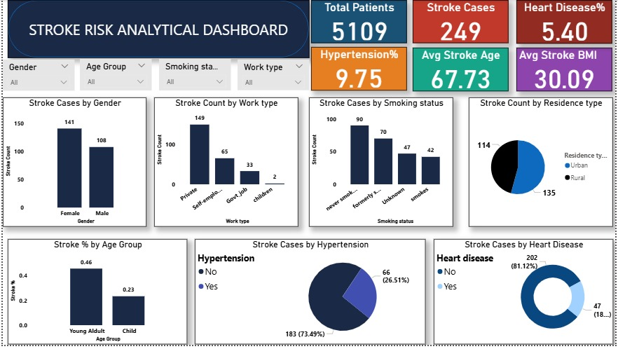
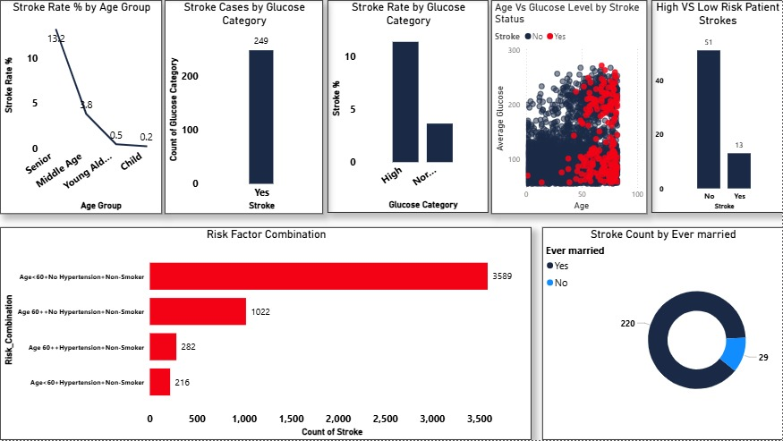

# Stroke Risk Analytics Project

##  Project Overview
This project analyzes stroke risk patterns using the Kaggle Stroke Prediction Dataset (5,109 patients).

The analysis is presented through two Power BI dashboards focusing on demographic distribution and advanced risk segmentation.

## Dashboard 1: Stroke Risk Overview Dashboard

This dashboard presents high-level KPIs and demographic insights.

Key Metrics:
- Total Patients: 5,109
- Stroke Cases: 249 (4.87%)
- Average Stroke Age: 67.7 years
- Gender distribution of stroke cases
- Hypertension and smoking breakdown

---

## Dashboard 2: Stroke Risk Factor Deep Dive Dashboard

This dashboard explores deeper risk relationships and segmentation.

Includes:
- Stroke distribution by glucose category
- Risk factor combination analysis
- Age vs Glucose scatter analysis
- High-risk population segmentation

---

##  Tools Used
- Power BI
- DAX
- Data Cleaning & Transformation

---

## Dataset Source
Kaggle Stroke Prediction Dataset  
(Note: Dataset not included due to licensing considerations.)

---

## Future Improvements
- Logistic regression stroke prediction model
- Risk scoring framework
- Feature importance analysis
- Deployment via Power BI Service
